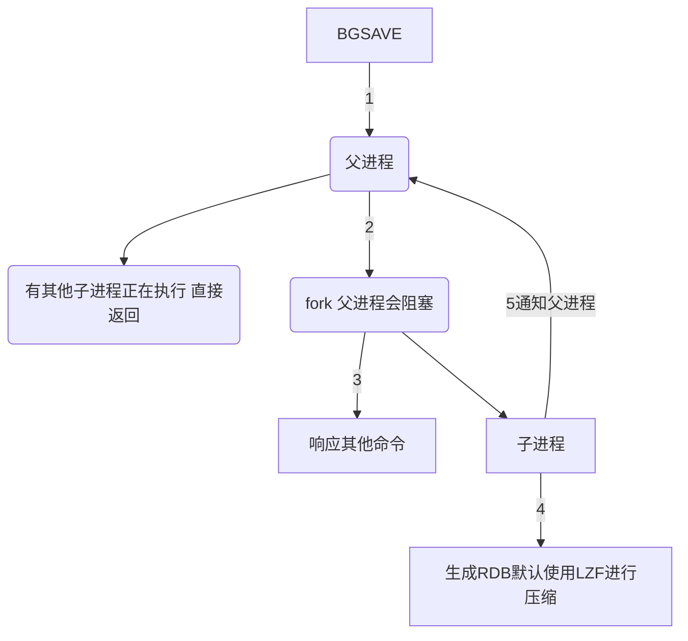
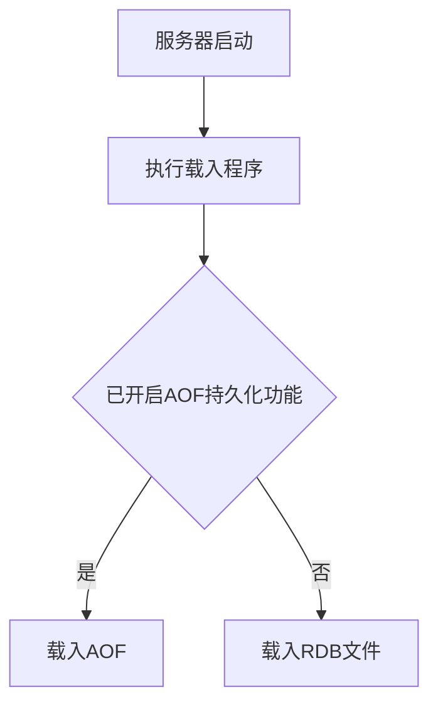
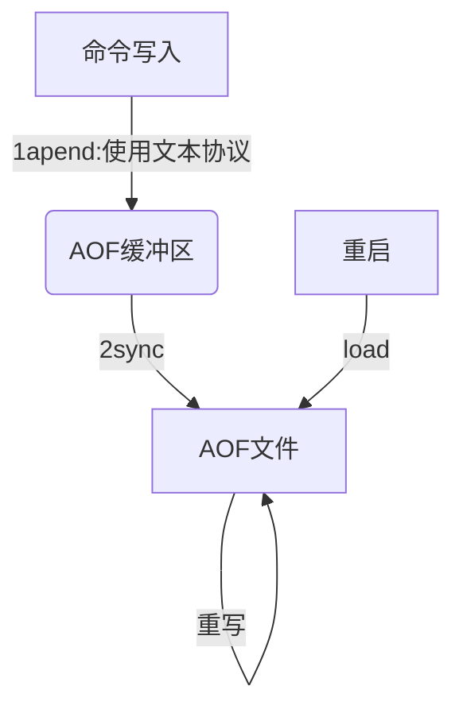
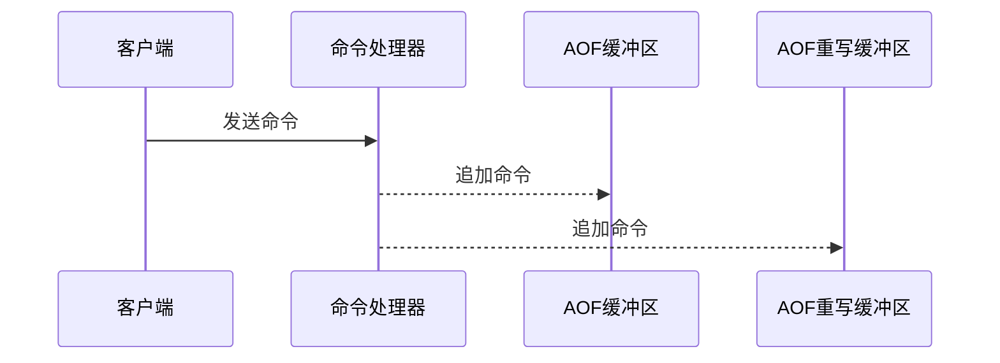
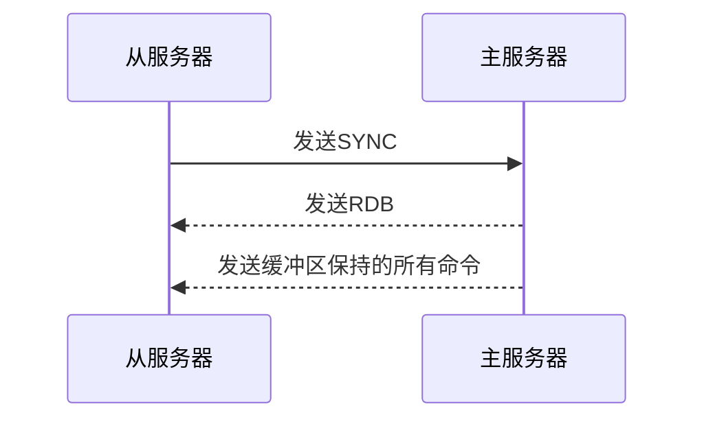
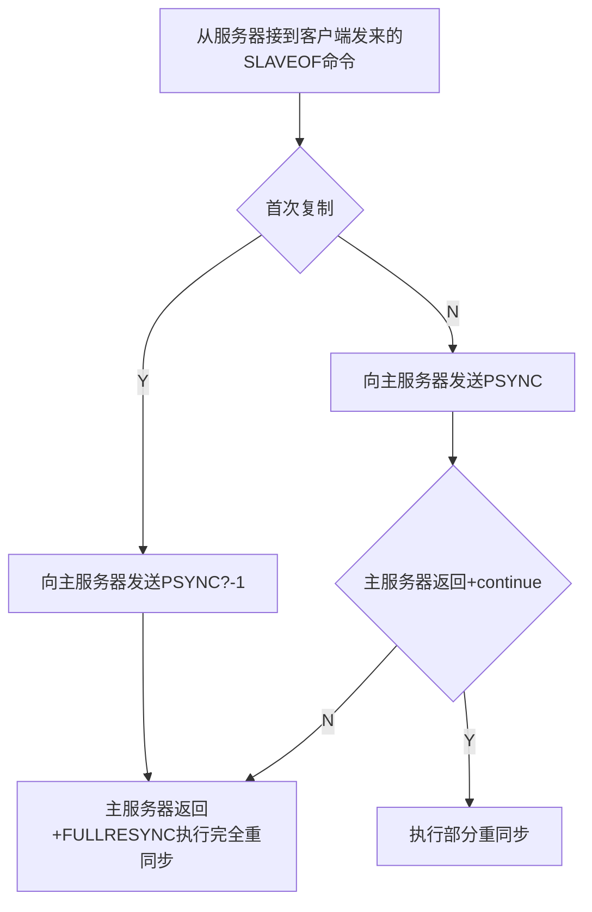

title: redis持久化
tags: [redis]
categories:
  - redis
date: 2021-07-26 00:51:00
---

## 持久化
因为redis是内存数据库，一旦服务器进程退出，那么内存的数据将会销毁。为了保存redis的内存数据，就需要一种将内存落盘的持久化手段，服务器重启后能够加载落盘后的数据来恢复服务器的状态。
持久化的方式有RDB[快照]和AOF[日志追加]两种。
## RDB--快照文件(恢复时间快但丢失数据多)
### 创建RDB文件--SAVE和BGSAVE
1. 为了防止生成RDB过程中，写入的数据干扰RDB的生成。
**SAVE 保存EDB过程会阻塞主进程，BGSAVE通过fork子进程，父进程正常工作。**
bgsave命令的运作流程，如下所示。

RDB文件可以落盘或者通过网络发生给其他节点进行复制。
* 在执行BGSAVE期间，服务器处理SAVE，BGSAVE和REWRITEAOF的命令与平时不同
    1. 执行BGSAVE期间，执行SAVE和BGSAVE是会被拒绝的。因为父进程和子进程之间存在竞争条件。
    2. BGSAVE和REWRITEAOF的命令不能同时执行。如果BGSAVE先执行，那么REWRITEAOF会延时。放过来，BGSAVE会被拒绝。
### 加载RDB文件
服务器载入文件的流程，如下所示

### RDB的优缺点
* 优点
1.  RDB是一个紧凑压缩的二进制文件，代表Redis在某个时间点上的数据快照。非常适用于备份，全量复制等场景。把RDB文件拷贝到远程机器或者文件系统中（如hdfs），用于灾难恢复。
2. Redis加载RDB恢复数据远远快于AOF的方式。
* 缺点
1. RDB方式数据没办法做到实时持久化/秒级持久化。因为bgsave每次运行都要执行fork操作创建子进程，属于重量级操作，频繁执行成本过高。
2.  RDB文件使用特定二进制格式保存，Redis版本演进过程中有多个格式的RDB版本，存在老版本Redis服务无法兼容新版RDB格式的问题。？？？ 有哪些格式
## AOF--独立日志方式
AOF（append only file）持久化：以独立日志的方式记录每次写命令，重启时再重新执行AOF文件中的命令达到恢复数据的目的。主要解决数据持久化的实时性问题。
### AOF的工作流程
AOF的工作流程操作：命令写入（append）、文件同步（sync）、文件重写（rewrite）、重启加载。

* 为什么命令写到AOF缓冲区，而不是直接写入到AOF文件?
    1. Redis使用单线程响应命令，如果每次写AOF文件命令都直接追加到硬盘，那么性能完全取决于当前硬盘负载。
    2. 写入缓冲区，redis就可以提供多种同步磁盘策略，也就是落盘的方案选择可以有多种。
* AOF缓冲区同步策略有哪些？
    1. always: 命令写入缓冲区后，立马同步硬盘。
    2. everysec: 每秒同步一次缓冲区。
    3. no: 有操作系统策略进行同步。
 * 为什么需要重写？解决了什么问题？
   AOF是通过保存写命令来记录数据库的状态，但是随着写入的命令增多，文件的体积就会越来越大。AOF文件过大会造成影响redis和宿主机的性能，并且过大的AOF文件还原需要的时间也就越多。重写通过构造某个时刻数据库的状态的写入语句来减少AOF的命令数目，从而实现压缩AOF的目的。
 * 重写的原理是什么？
    AOF的重写**不是对旧的AOF文件进行读取、分析或者写入操作，而是通过读取当前数据库的状态来实现的。**
    假如使用了3条命令分别写入了键为key的， value分别为a b c的list，AOF的重写就是读取当前数据库的状态，重写的命令为1条 写入 key a b c的命令。
    总之，首先从数据库读取键现在的值，然后用一条命令去记录键值对，代替之前记录这个键值对的多条命令。
  * redis是单线程的，AOF重写如何防止阻塞主进程呢？
    AOF的重写是后台进行的。
    1. 发起AOF重写时，会在父进程fork子进程来进行重写，同时创建AOF重写缓冲区。
    2. 重写后的命令会写入AOF重写缓冲区。
      

    
    3. 新写入的命令，父进程处理后，会同时写入AOF缓冲区和AOF重写缓冲区，防止重写AOF时，导致数据不一致的问题。
    4. 但子进程完成AOF重写后，会向父进程发生信号。
    5. 父进程此时会阻塞客户端的命令，来将重写后的AOF更替成就的AOF.首先将AOF重缓冲区写入新的AOF文件，然后将AOF进行改名并覆盖旧的AOF.
## 主从复制
使用A服务器的客户端输入:SLAVEOF B{IP:端口} 那么A就是变成B的从服务器，B的数据也会同步到A中。也就是主服务器B会同步数据给从服务器A。
新版的主从复制包括完全重同步和部分重同步，旧版的主从复制只有完全重同步。
  **旧版的主从复制，如果网络闪断会进行一次完全的同步，会消耗大量的资源，导致同步时间变长。**
  完全重同步：主要用于初次进行主从复制或者长时间断联后重新同步。主服务生成RDB文件，同时将启动生成RDB文件后的命令写入缓冲区。RDB生成后发生给从服务器，等RDB被从服务器加载完后，再将缓冲区命令发给从服务器。
  部分重同步:主要用于网络闪断的同步恢复。从服务断联后，重新连上到主服务，如果条件允许（数据偏移量相差在一定范围），主服务会把断联期间的数据发生给从服务进行同步。
  * 完全重同步跟旧版的复制功能几乎一样，如图。
  
  

  * 部分重同步
  部分重同步主要以3部分组件实现：
        1. 主服务器和从服务器的复制偏移量，用于检查主从服务器是否一致，从服务器是每秒发生一次心跳给主服务器同步偏移量。
    2. 主服务器的复制积压缓冲区（默认为1M），主服务器的每条写命令都会写入复制缓冲区和从服务器。
    3. 服务器的运行ID。
   * 部分重同步实现步骤：
    1. 每次主服务器向从服务器发生写命令时，会同步数据偏移量，并把写命令写入复制积压缓冲区。
    2. 从服务器断联后，一段时间重新连接上主服务器，会向主服务发生PSYNC并报告自己的数据偏移量。
    3. 主服务器收到从服务器的偏移量，计算目前积压缓冲区的偏移能否可以完成从服务器的同步，如果不可以那么就会进行完全同步，如果可以，就把积压缓冲区的命令发送给从服务器。
   4. 从服务同步完数据后，更新偏移量。
### PSYNC的工作流程

### 主从复制过程中对过期的键的处理    
 主从服务过程过期键的处理有特别的方式。**注意从服务器是无法自行删除过期键的，必须由主服务器触发，其实从服务器触发了惰性删除也不会执行，这样为了保持主从的一致性**，以下讲述，生成和加载RDB和AOF过程的过期键处理方式。
 1. 生成RDB--子进程进行
    * redis会对数据库的键进行检查，过期键不会生成RDB
  2. 载入RDB--是否容忍键检查的时间开销
   * 如果是主服务加载RDB，那么会对键进行检查，过期键不会加载到RDB。
   * 如果服务是从服务器，从服务器不管是否RDB是否有过期键，都会加载到武器。
  3. 生成AOF--是否容忍键检查的时间开销
   * 如果数据库中存在已经过期的键，但是未被惰性或定期删除，那么也会这些过期的键也会生成到AOF文件中。
   * 如果键被过期了，且触发了删除操作，那么AOF也会追加删除命令。
   4. AFO重写--子进程进行
  *  AOF重写会校验过期的键，不会写入到重写的AOF中。
总之, 主服务器生成或加载RDB时，会忽略过期的键，因为主服务是通过子进程生成RDB的，由生成方保证数据的最新对redis服务器影响最小，并且主服务加载RDB一般是服务启动时，可以检查键过期，导致等待时间长不会造成功能问题；从服务器为了提高RDB的加载效率，尽快地进行数据同步，例如长时间断联后，进行完成重同步不能等待太久，所有不会对键的过期进行检查，直接加载RDB。生成AOF的频率比极高，不允许频繁检查键是否过期，所有会直接加载数据库的数据。AOF重写是在子进程操作，对父进程影响小，而且是进行优化目录来重写的，所有允许进行检查键是否过期。
  * 一言蔽之，**复制过程中，是否进行键检查，取决于操作是否在子进程进行， 是否能容忍长时间的检查操作。**
